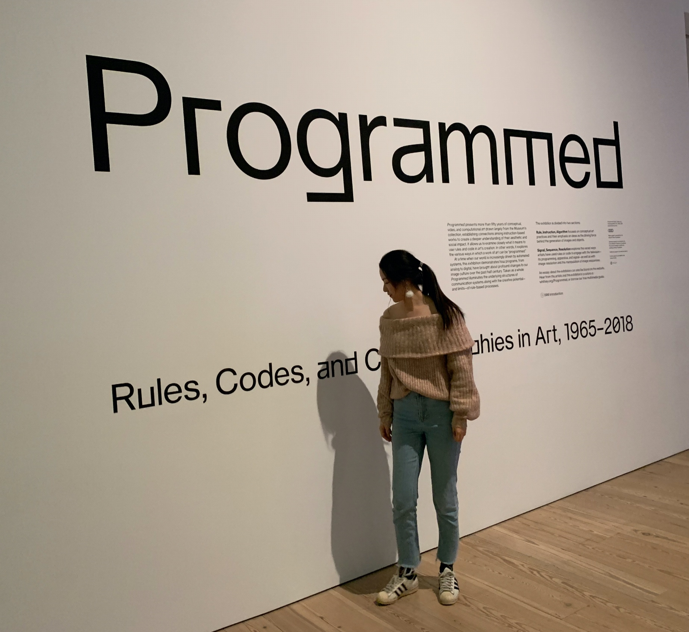

---
# You don't need to edit this file, it's empty on purpose.
# Edit theme's home layout instead if you wanna make some changes
# See: https://jekyllrb.com/docs/themes/#overriding-theme-defaults
layout: default 
---

<!-- I am a fifth-year Ph.D student at the department of computer science, the University of Chicago. I am working with [Prof. Kevin Gimpel](https://ttic.uchicago.edu/~kgimpel/) on Natural Language Processing, Machine Learning, and Deep Learning. Prior to that, My research was mainly focused on Computer System and Computer Architecture.
 -->
 

    
    

        <h2> Xiaoan Ding </h2>
        <h3>University of Chicago </h3>
        <h3> Email: xiaoanding at uchicago dot edu </h3>
        I am a fifth-year Ph.D student at the department of computer science, the University of Chicago. I am working with <a href="https://ttic.uchicago.edu/~kgimpel/">Prof. Kevin Gimpel</a> on Natural Language Processing, Machine Learning, and Deep Learning. My research focus on neural model robustness in text classification, controllable text generation, and latent-variable modeling of sentence. Prior to that, My research was mainly focused on Computer System and Computer Architecture.
        

        I am currently searching for a full time position.
    

    

        
        Whitney Musuem @ NYC, 2018
    

---
# Publication

- [Discriminatively-Tuned Generative Classifiers for Robust Natural Language Inference](http://arxiv.org/abs/2010.03760).  
**Xiaoan Ding** *, Tianyu Liu *, Baobao Chang, Zhifang Sui, Kevin Gimpel (EMNLP'20)

- [An Empirical Study on Model-agnostic Debiasing Strategies for Robust Natural Language Inference](https://arxiv.org/abs/2010.03777). 
    Tianyu Liu *, Xin Zheng *, **Xiaoan Ding**, Baobao Chang, Zhifang Sui (CoNLL'2020)

- [Generating Diverse Story Continuations with Controllable Semantics](https://arxiv.org/abs/1909.13434).  
Lifu Tu, **Xiaoan Ding**, Dong Yu, Kevin Gimpel (EMNLP WNGT'19)  

- [Latent-Variable Generative Models for Data-Efficient Text Classification](https://arxiv.org/abs/1910.00382).  
**[[code](https://github.com/AnnDing/Generative_classifier)]**  
**Xiaoan Ding**, Kevin Gimpel (EMNLP'19)

- [Cross-layer refresh mitigation for efficient and reliable DRAM systems: A comparative study](https://ieeexplore.ieee.org/document/8242065).  
**Xiaoan Ding**, Xi Liang, Yanjing Li (ITC'17)
   
- [JellyFish: Online Performance Tuning with Adaptive Configuration and Elastic Container in Hadoop Yarn](https://ieeexplore.ieee.org/document/7384375).  
**Xiaoan Ding**, Yi Liu, Depei Qian (ICPADS'15)

# Awards

- UU Fellowship 2017
- Google Excellence Scholarship 2012
- National Schorlarship 2011

# Contact

- Email Address: xiaoanding at uchicago dot edu

- Office Address:  
   JCL 375  
   Department of Computer Science  
   The University of Chicago  
   5730 S. Ellis Avenue  
   Chicago, IL 60637  

